# ✈️ Analyse et Prédiction des Retards Aériens (Data Mining)

[](https://www.python.org/)
[](https://jupyter.org/)
[](https://opensource.org/licenses/MIT)

Bienvenue dans le dépôt de notre projet de **Data Mining** consacré à l'analyse et à la prédiction des retards de vols à l'arrivée. Ce projet, réalisé dans le cadre du cours de Data Mining, explore un jeu de données opérationnel de plus de 5 millions de vols pour comprendre les mécanismes sous-jacents aux retards et évaluer la performance de différents modèles de *machine learning*.

**Auteur :** Arouna Roméo KONE 
**Année universitaire :** 2025-2026

---

##  Problématique et Objectifs

Le transport aérien est un secteur où la ponctualité est cruciale. Les retards génèrent des perturbations en cascade, des coûts supplémentaires et l'insatisfaction des passagers.

L'objectif de ce projet est double :

1. **Comprendre** les facteurs associés aux retards à travers une analyse exploratoire approfondie.
2. **Prédire** la survenue d'un retard significatif (>3 minutes) à l'aide de modèles de *machine learning*, en respectant des contraintes opérationnelles fortes (pas de fuite de données).

---

## Aperçu des Données

Les données proviennent du *Bureau of Transportation Statistics* (BTS) et couvrent l'ensemble des vols domestiques aux États-Unis pour l'année 2015.

- **`flights.csv`** : +5 millions de vols avec horaires, retards, aéroports, etc.  
- **`airlines.csv`** : Noms et codes des compagnies aériennes.  
- **`airports.csv`** : Informations géographiques sur les aéroports (ville, état, coordonnées).  

---

## 🛠️ Méthodologie

Notre approche s'articule autour de quatre grandes phases :

1. **Préparation des données :** Traitement des variables temporelles, gestion rigoureuse des valeurs manquantes (analyse MNAR), sélection des variables pour éviter la fuite d'information.  
2. **Analyse exploratoire (EDA) :** Étude univariée, bivariée, temporelle et géographique pour déceler les patterns et structures des retards.  
3. **Modélisation supervisée :** Comparaison de la régression logistique, du Random Forest et du Gradient Boosting (XGBoost) pour prédire les retards.  
4. **Segmentation non supervisée :** Utilisation de K-Means et de la CAH pour identifier des profils types de vols.  

---

##  Comment Exécuter le Projet ?

### Prérequis

- Python 3.8 ou supérieur  
- Bibliothèques : `pandas`, `numpy`, `matplotlib`, `seaborn`, `scikit-learn`, `xgboost`, `jupyter`

### Installation

1. Clonez le dépôt :

```bash
git clone https://github.com/votre-nom-utilisateur/analyse-retards-aeriens.git
cd analyse-retards-aeriens
```

2. Installez les dépendances :

```bash
pip install -r requirements.txt
```

3. Lancez le notebook principal :

```bash
jupyter notebook Analyse_Retards_Aeriens.ipynb
```

---

## 🔍 Résultats Clés et Visualisations

### 1. Préparation et Nettoyage des Données

Une analyse de la structure des valeurs manquantes a révélé une **bipartition claire** entre les variables opérationnelles (quasi-complètes) et les variables de causes de retard (manquantes de façon structurelle, de type MNAR).

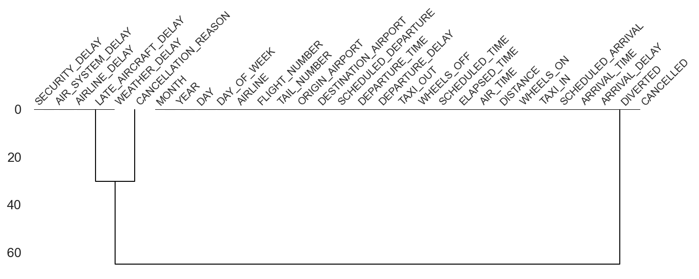

### 2. Analyse Univariée de la Variable Cible

Le retard à l'arrivée (`ARRIVAL_DELAY`) présente une distribution fortement asymétrique. Nous avons fixé un seuil de **3 minutes** pour binariser la variable, ce qui permet de distinguer un retard opérationnellement significatif du bruit de mesure.

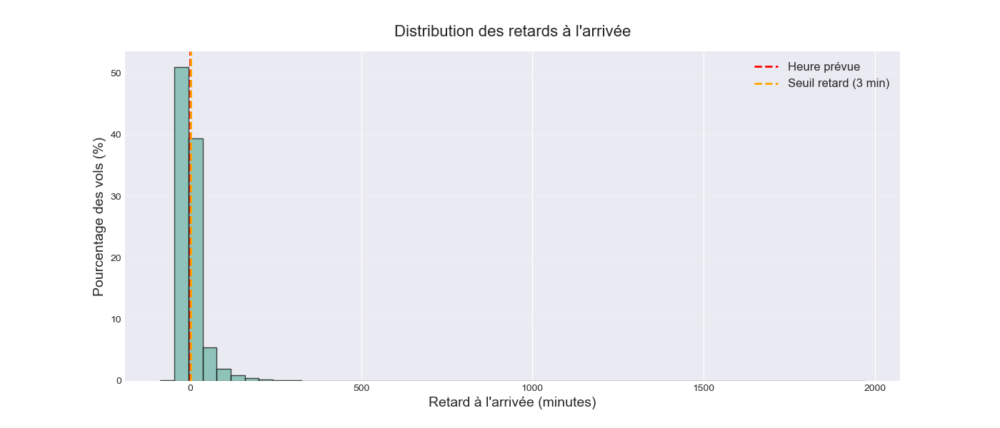
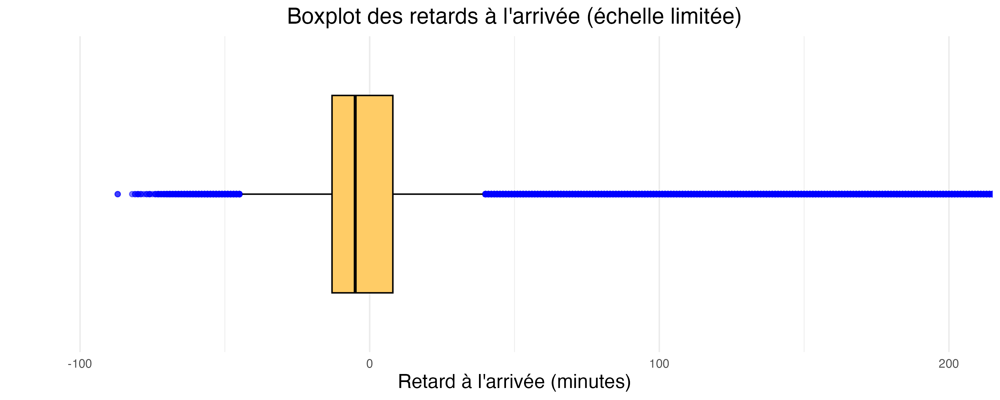

### 3. Performance des Compagnies Aériennes

L'analyse montre une hétérogénéité marquée des performances entre compagnies, avec des low-cost comme Spirit Airlines (NK) affichant les retards moyens les plus élevés.

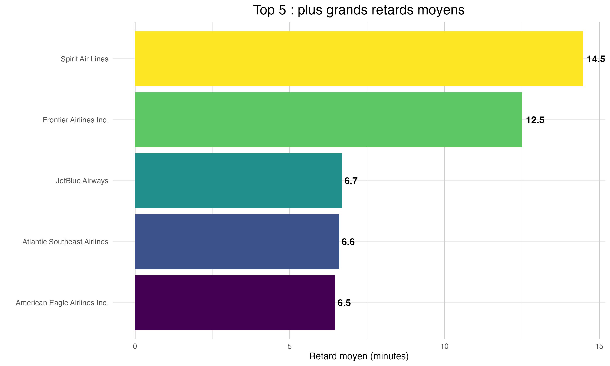
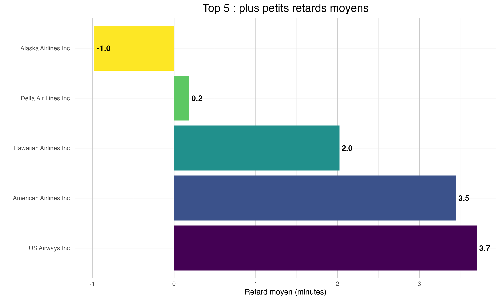

### 4. Corrélation : Le Rôle Clé du Retard au Départ

La matrice de corrélation met en évidence une relation quasi-parfaite entre le retard au départ et le retard à l'arrivée (ρ = 0.94). Le temps de roulage (`TAXI_OUT`) apporte une information complémentaire et indépendante.

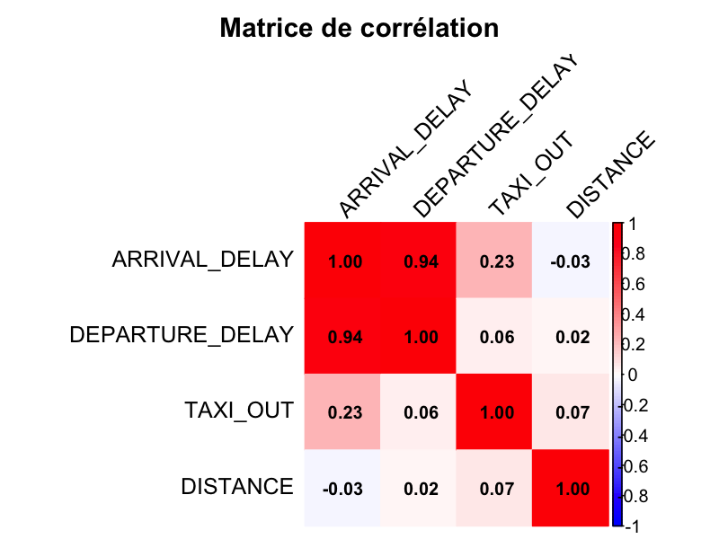

### 5. Analyse Temporelle : L'Effet Domino

La probabilité de retard augmente de façon quasi-linéaire au cours de la journée, illustrant le phénomène de propagation et d'accumulation des retards.

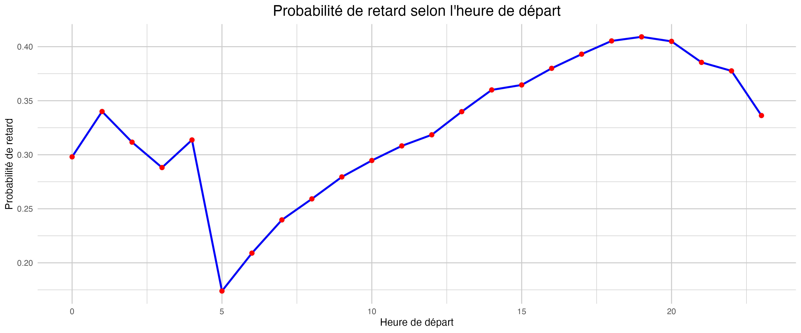

### 6. Analyse Géographique : Concentration du Trafic

La cartographie des vols révèle une concentration extrême du trafic sur les hubs majeurs des côtes Est et Ouest, rendant ces zones structurellement plus vulnérables aux retards de congestion.

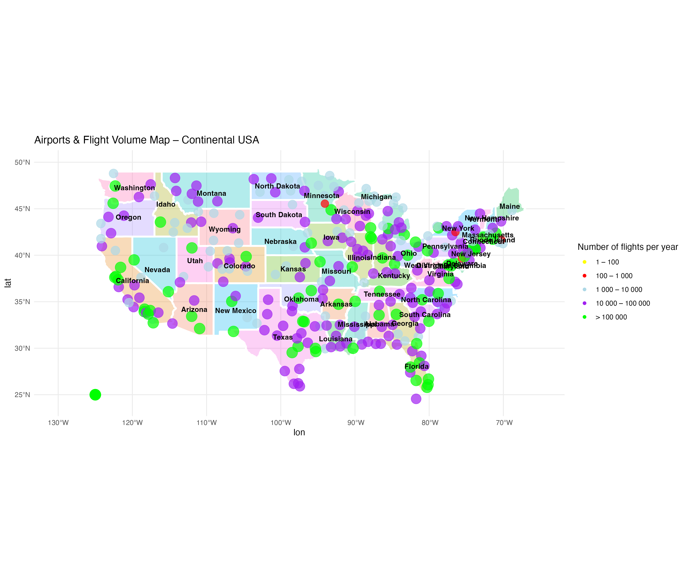

### 7. Modélisation Supervisée : Comparaison des Performances

Le **Gradient Boosting (XGBoost)** offre le meilleur compromis entre précision élevée et stabilité, le rendant idéal pour un déploiement opérationnel.

| Modèle                | Précision (Test) | F1-Score  | Précision (Classe 1) | Rappel (Classe 1) | AUC       |
| --------------------- | ---------------- | --------- | -------------------- | ----------------- | --------- |
| Régression Logistique | 0.884            | 0.838     | **0.900**            | 0.784             | **0.935** |
| Random Forest         | 0.876            | 0.829     | 0.876                | **0.785**         | 0.929     |
| **Gradient Boosting** | **0.879**        | **0.828** | **0.902**            | 0.766             | 0.931     |

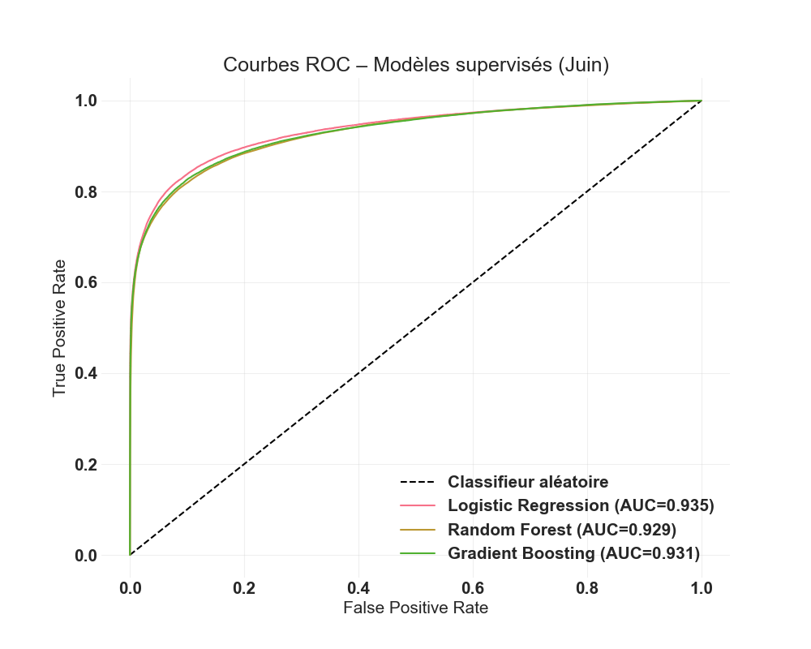

### 8. Segmentation Non Supervisée : Typologie des Vols

Le clustering a permis d'identifier des profils de vols aux caractéristiques distinctes, comme un cluster de vols "à congestion pathologique" caractérisé par des temps de roulage extrêmement longs.

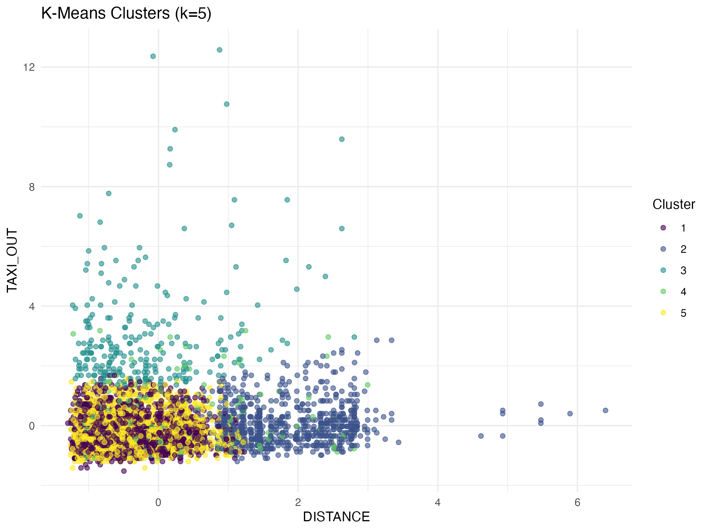
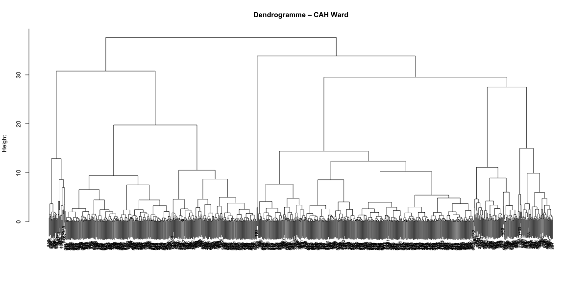

---

## Conclusions et Perspectives

- **Le retard au départ est le principal prédicteur**, avec une relation fortement linéaire.  
- Le **temps de roulage** est une source de retard autonome et non négligeable.  
- Le **Gradient Boosting** est le modèle recommandé pour sa stabilité et sa haute précision.  
- Le "plafond" de rappel observé (~78%) suggère que les améliorations futures viendront de l'intégration de **données externes** (météo, trafic en temps réel) plutôt que d'algorithmes plus complexes.

---

## 📁 Structure du Projet

```
.
├── flightdelay.ipynb   # Notebook principal avec l'analyse complète
├── README.md                        # Ce fichier
├── requirements.txt                  # Dépendances Python
├── datain/                             # Dossier pour les données (non versionnées)
│   ├── flights.csv                   #trop lours pas present
│   ├── airlines.csv
│   └── airports.csv
└── images/                           # Visualisations générées
    ├── missdendo.png
    ├── matrice_correlation.png
    └── ...
```

---

## Licence

Ce projet est sous licence MIT. Voir le fichier `LICENSE` pour plus de détails.
